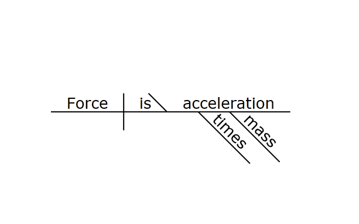

# How to Theme

## A guided syllabus for making a theme

<http://static.davidthemachine.org/placeholder>
<!-- make this a footer? -->

---

What you're going to need:

* A knowledge of HTML and CSS
* A text editor that has **syntax coloring**
  * Sublime (cross-platform) <http://www.sublimetext.com/>
  * Gedit (cross-platform) <https://wiki.gnome.org/Apps/Gedit#Download>
  * Coda (Mac OS) <https://panic.com/coda/>
  * Notepad++ (Windows) <http://notepad-plus-plus.org/>
  * Dreamweaver (Mac OS & Windows) <http://www.adobe.com/products/dreamweaver.html>

---

# Syntax Coloring

Like having sentences diagrammed for you

---

TODO: picture of plain code

TODO: picture of syntax highlighted code

---

# Preparing Your Wordpress Install for Theming

* Work on a standalone, private server, I recommend DesktopServer, but I have
  not used it

  <http://serverpress.com/products/desktopserver/>

* Import theme testing content using the steps outlined at

  <http://codex.wordpress.org/Theme_Unit_Test>

---

# Things you will learn

* PHP

* WordPress Functions

* WordPress Theme Organization

All at once!

---

# Immersion

We're going to look at the Naked Theme, hosted at
<http://naked-wordpress.bckmn.com/>. It's made for people to study and learn
from.

---

What you need to know about PHP to understand what's in the Naked Theme:

* Comments

  The Naked Theme has extensive comments written about what is going on in all
  the pages and all the parts of the theme

* Control Structures

* Where to read up about these things

  * <http://php.net>
  * <http://stackoverflow.com>
  * <http://wordpress.stackexchange.com>

---

# WordPress functions

WordPress is written with PHP, and you'll need to learn the PHP functions that
WordPress uses, and how a theme is organized

Learning how to navigate the Codex is half the battle, as GI Joe would say.

* <http://codex.wordpress.org>

---

WordPress developers are working on a better approach to documenting how
WordPress does things, and the resulting site is:

* <http://developer.wordpress.org/reference/>

---

# Theme organization

<http://codex.wordpress.org/Template_Hierarchy>

---

# Underscores

<http://underscores.me>

---

# Checking Your Work

Is your theme made using the latest that WordPress has to offer? Is it put
together correctly?

WordPress Theme Check <https://wordpress.org/plugins/theme-check/>

Every theme get gets hosted at WordPress.org has to pass these checks.

---

# Jumping In the Deep End

Take an old theme, and make it Theme Check stops complaining about it

Like the old Default Theme

<http://wordpress.org/themes/default>
