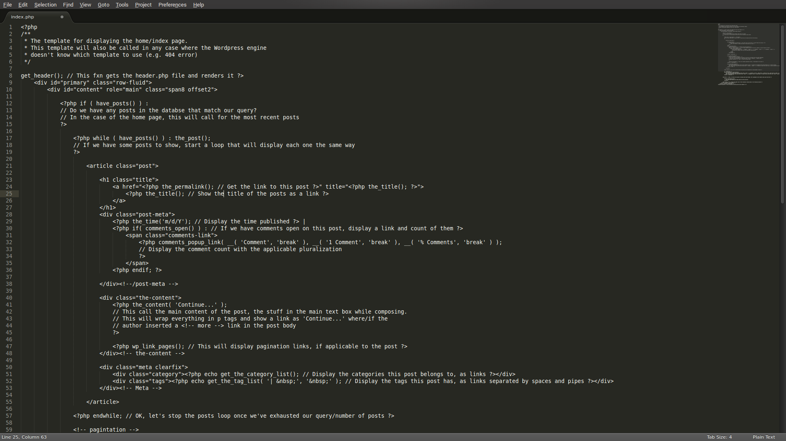
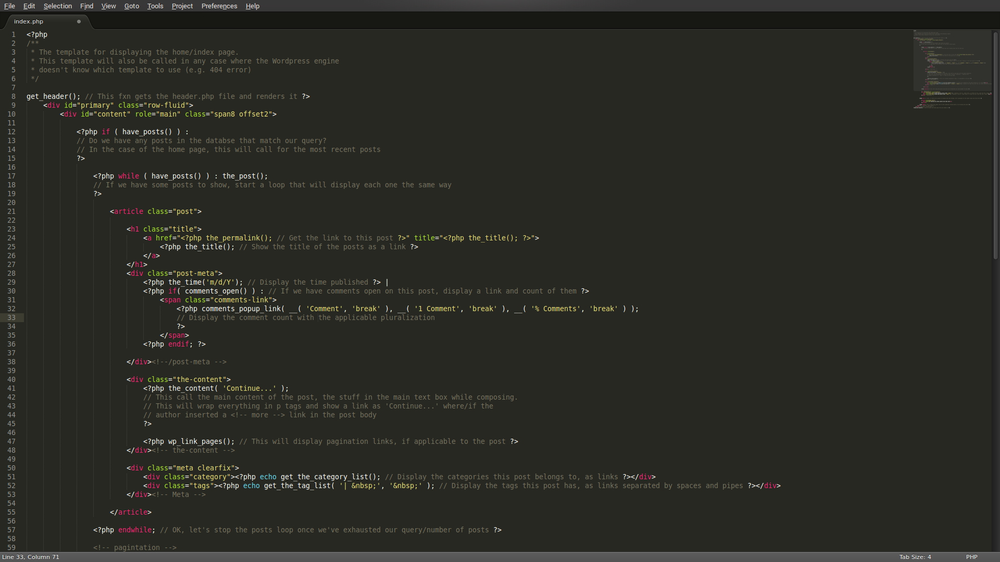
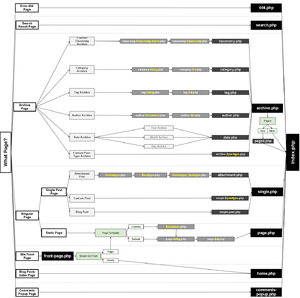

# How to Theme

## A guided syllabus for learning how to make a WordPress theme

<http://static.davidthemachine.org/presos/ocwp-201407-design.html>
<!-- make this a footer? -->

# Preparation

What you're going to need:

A knowledge of HTML and CSS

A text editor that has **syntax coloring**

* Sublime (cross-platform) <http://www.sublimetext.com/>
* Gedit (cross-platform) <https://wiki.gnome.org/Apps/Gedit#Download>
* Coda (Mac OS) <https://panic.com/coda/>
* Notepad++ (Windows) <http://notepad-plus-plus.org/>
* Dreamweaver (Mac OS & Windows) <http://www.adobe.com/products/dreamweaver.html>

# Syntax Coloring

Like having sentences diagrammed for you

# Which would you rather read?

](img/nosyntax_crop.png)
](img/syntax_crop.png)

Line Numbering also helps, but it's not essential

# Prepare WordPress for Theming

Work on a standalone, private machine, I recommend DesktopServer, but I have not
used it

  <http://serverpress.com/products/desktopserver/>

Import theme testing content using the steps outlined at

  <http://codex.wordpress.org/Theme_Unit_Test>

# Things you will learn

* PHP

* WordPress Functions

* WordPress Theme Organization

All at once!

# Immersion

We're going to look at the Naked Theme, hosted at
<http://naked-wordpress.bckmn.com/>. It's made for people to study and learn
from.

# What's needed for a theme?

At the bare minimum: `style.css` and `index.php` files

The `style.css` file has a special header section that announces the name of the
theme, the author, and other details. While this section is commented out, it
still has power, and are the starting of a theme.

From Naked Theme:

    /*
    Theme Name: Naked Wordpress
    Theme URI: http://bckmn.com/naked-wordpress
    Author: J Beckman
    Author URI: http://bckmn.com
    Description: A super bare theme for designers who don't know Wordpress PHP but
    want to build with Wordpress.
    Version: 1.0
    License: GNU General Public License
    ...
    */

# PHP Crash Course

What you need to know about PHP so you're familiar with what's in a typical theme.

My approach to learning a new language is to get reading comprehension in place
before learning to write.

This is a quick overview, at 40,000 feet at a cruising velocity of 580 miles per
hour.

# PHP Blocks

Marked with

    <?php ... ?>

Just as a sentence needs to end with '.' or '?' or '!' to be correct, PHP
statements must end with a ';' to be correct.

# Hello World

For programming languages, the tradition is to show off what an "easy" program
would look like:

    <?php
    echo "Hello World";
    ?>

# Code Comments

The Naked Theme has extensive comments written about what is going on in all
the pages and all the parts of the theme

    // This is a standalone comment

    # This is another standalone comment

    /*
    * this style of commenting you've seen before in CSS
    */

# PHP Grammar

Be able to recognize what piece of a statement is what

## Nouns & Verbs & Conjunctions (Control Structures)

Be able to recognize what part of the PHP statement is what.

# Nouns

Variables: Numbers, Strings, PHP treats them differently

They show up in code like:

    $variable = 5;
    $another_variable = "shoes";

Strings need quotes, "" or '', they can be joined together (concatenated) with
a '.'

Numbers: anything you can do arithmetic with, or compare with
less-than/greater-than

# Compound Nouns

Arrays: A list of variables that's referred to as a single variable.

Flat list, or "Number-indexed Array":

    $numbers = array( 1, 2, 3, 4, 5, 6 );
    $vowels = array( "a", "e", "i", "o", "u" );

Labeled List, or "Associative Array":

    $post_details = array(
      "title" => "Post Title",
      "author" => "Post Author",
      ...
    );

There are different ways to write out arrays <http://us3.php.net/manual/en/function.array.php>

There can be arrays of arrays, the rabbit hole goes and goes...

# Verbs

These are the functions & built-in PHP commands

# Control Structures, the Conjunctions of Programming

I will focus on the control structures used in the Naked Theme

# Conditionals

The most common type of conditional is the If-Then Statement:

    if ( have_posts() ) {       if ( have_posts() ):
      ...                         ...
    } else {                Or  else:
      ...                         ...
    }                           endif;

As if to say: "If this, then that."

# Loops

The workhorse of a WordPress theme is The Loop, and it's usually done with
a `while` statement. The while statement keeps working until the statement in
the first set of parenthese is no longer true.

    while( have_posts() ) {      while(  ):
      ...                    Or    ...
    }                            endwhile;

All the possible control structures used in PHP are documented at
<http://www.php.net/manual/en/control-structures.intro.php>

# Functions

A function is a bundle of programming commands.

    function naked_scripts()  {

      // get the theme directory style.css and link to it in the header
      wp_enqueue_style( 'naked-style', get_template_directory_uri() . '/style.css', '10000', 'all' );

      // add fitvid
      wp_enqueue_script( 'naked-fitvid', get_template_directory_uri() . '/js/jquery.fitvids.js', array( 'jquery' ), NAKED_VERSION, true );

      // add theme scripts
      wp_enqueue_script( 'naked', get_template_directory_uri() . '/js/theme.min.js', array(), NAKED_VERSION, true );

    }

Where to read up about functions in PHP

* <http://php.net>
* <http://stackoverflow.com>
* <http://wordpress.stackexchange.com>

# WordPress Functions

WordPress is written with PHP, and you'll need to learn the PHP functions that
WordPress uses, and how a theme is organized

Learning how to navigate the Codex is half the battle, as GI Joe would say.

* <http://codex.wordpress.org> (older)
* <http://developer.wordpress.org/reference/> (newer, not complete yet)

# `functions.php`

This is a file that has theme-specific functions that affect what's not easily
included in the pieces of a WordPress theme, like widget areas, menus, and
additional CSS & JS files you need to load up.

# Theme organization

<http://codex.wordpress.org/Template_Hierarchy>

# More on Theme Development

WordPress.org's introduction to Theme Development is at
<http://codex.wordpress.org/Theme_Development>

# Making your own theme from scratch?

Start from an empty file? No!

The WordPress theme developers have a template theme they use to build all their
new core themes, Underscores:

<http://underscores.me>

# Whitescreen

The result of loading a broken PHP file.

You **will** whitescreen your site when developing a theme, so if you're cowboy
coding anyways, don't.

Seriously, don't.

But on your own developer install, take those risks, learn what breaks
WordPress, and how to fix it.

# Diagnosing Whitescreens

Know where your development server keeps its server logs. The logs will tell
you, in PHP-ese, what your bug is. Copy/paste the error message into Google, and
see what comes up.

In your development `wp-config.php`, make sure you have:

    define( WP_DEBUG, TRUE );

DesktopServer has an option for "Enable Trace and Debug", turn it on for an even
greater deluge of logging details.

# Checking Your Work

Is your theme made using the latest that WordPress has to offer? Is it put
together correctly?

WordPress Theme Check <https://wordpress.org/plugins/theme-check/>

Every theme get gets hosted at WordPress.org has to pass these checks.

# Trial by Fire

Take an old theme, and make it Theme Check stops complaining about it

Like the old Default Theme

<http://wordpress.org/themes/default>
